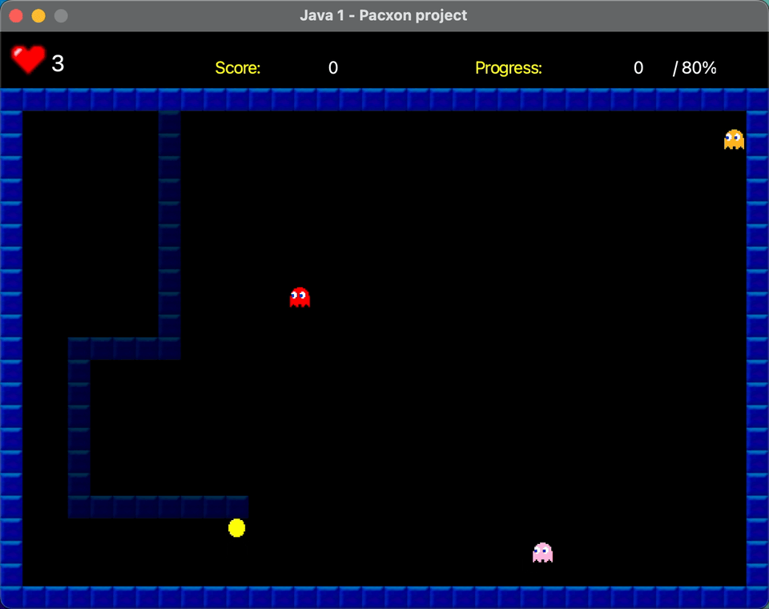
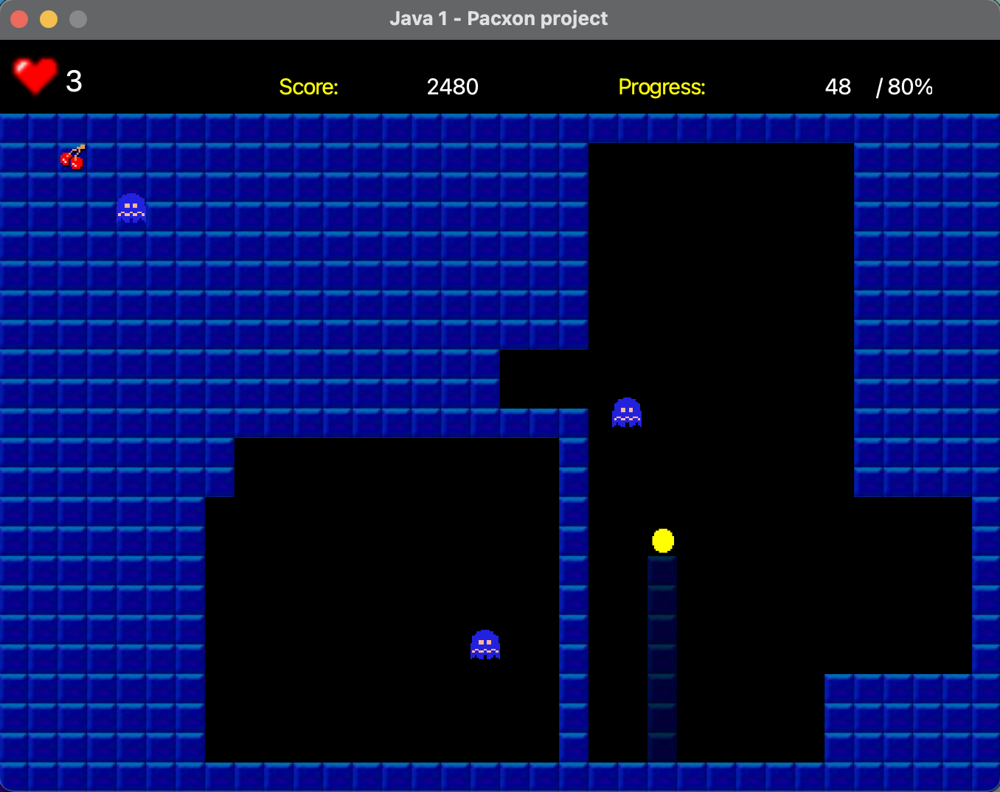

# Another Pacxon Clone

This project was created for my Java Programming II course.

## Features
- 3 levels
- Leaderboard
- Start & Game Over screens

## How to Play
- Use the arrow keys or WASD to move the player
- Get to 80% progress by filling in the empty space
- Avoid the ghosts
- Gather power-ups to gain points and eat ghosts
- ESC to quit

## Dependencies
- JavaFX
- JSON
